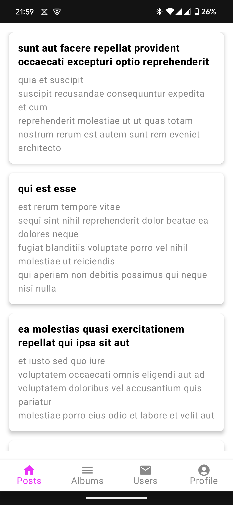
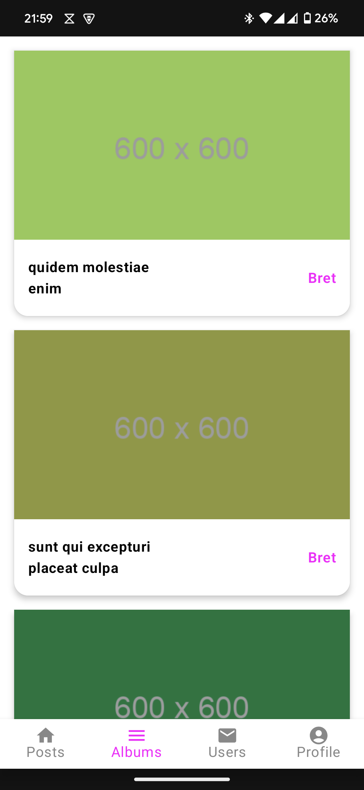
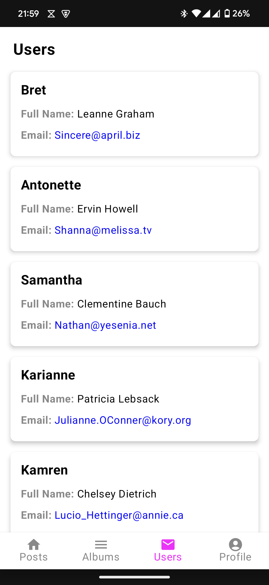
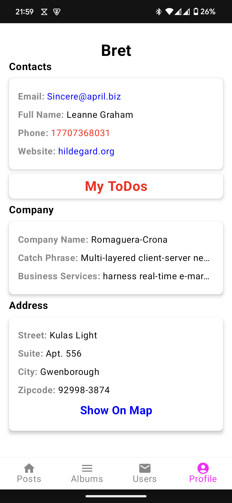
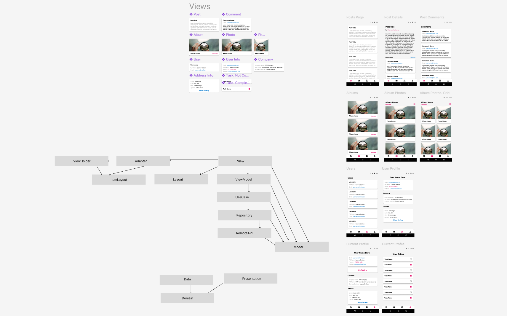
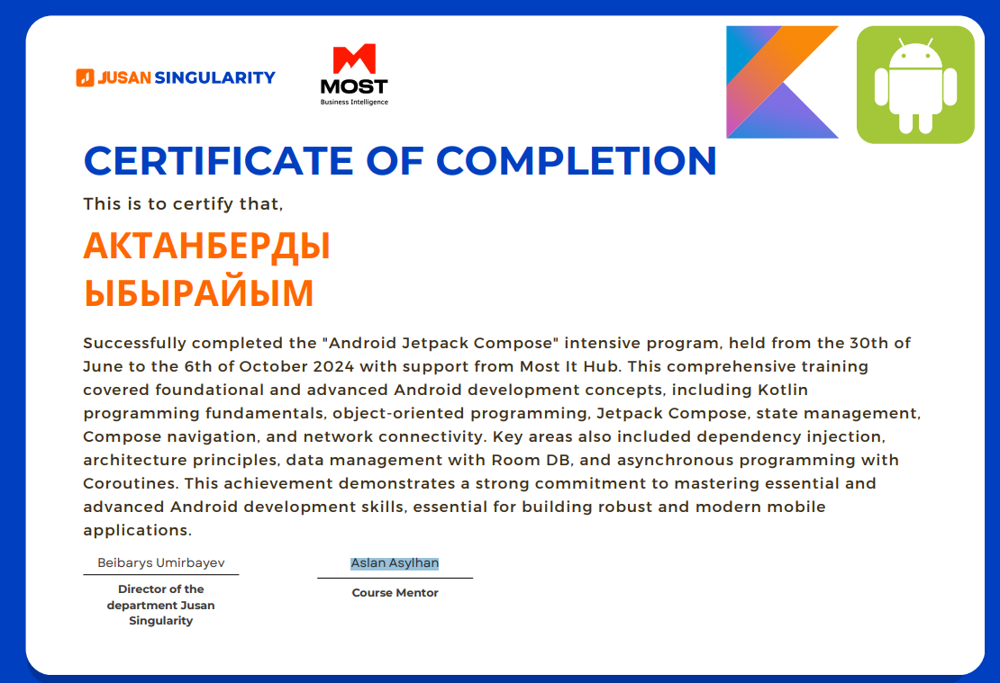

# Singularity
*Explore, connect, and organize in a unified experience!*

---

## 🚀 Features
- **Explore Content**: Watch posts, albums, photos, and commentaries.
- **User Profiles**: Browse user profiles, including contacts, companies, and addresses.
- **Tasks and Organization**: Manage your todos effortlessly.
- **Interactive Maps**: Check addresses directly on a map.
- **Multilingual Support**: Use the app in Russian, Kazakh, or English.
- **Detailed User Info**: Access comprehensive details about your profile and others'.

---

## 📸 Screenshots
### Main Screens





### Figma Project Overview


### Certificate of Completion


---

## 🛠️ Installation
### Requirements
- **Android Version**: Nougat (Android 7.0) or above.
- **Dependencies**: Hilt, KSP.

### Steps
1. Clone the repository:
   ```bash
   git clone https://github.com/aqtanb/JetpackSocialMedia.git
   ```
2. Open the project in Android Studio.
3. Sync Gradle dependencies.
4. Build and run on an emulator or a connected device.

---

## 🧑‍💻 Development
### Tech Stack
- **Retrofit**: For networking.
- **Hilt**: Dependency injection.
- **OkHttp**: HTTP client for efficient networking.
- **KSP**: Kotlin Symbol Processing.
- **Navigation**: Seamless in-app navigation.
- **MVVM**: Clean architecture pattern.
- **Gradle**: Build automation.
- **Multi-Module Architecture**: For modular and scalable development.

### Development Process
- Designed UI and UX in Figma for a consistent look.
- Followed MVVM for maintainable and testable code.
- Leveraged multi-module architecture to improve scalability.

---

## 🔗 Links
- **GitHub Repository**: [Singularity](https://github.com/aqtanb/JetpackSocialMedia)

---

## 🤝 Acknowledgements
This project was developed as part of the **Jusan Singularity IT Camp** (June 2024 – October 2024) with support from **Most IT Hub**.

Special thanks to:
- **Aslan Asylhan**, course mentor, for code reviews and invaluable guidance.
- **Jusan Singularity**, IT Camp team, for providing this incredible opportunity.

---
